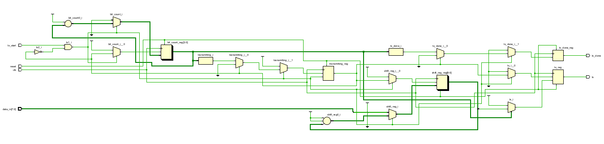
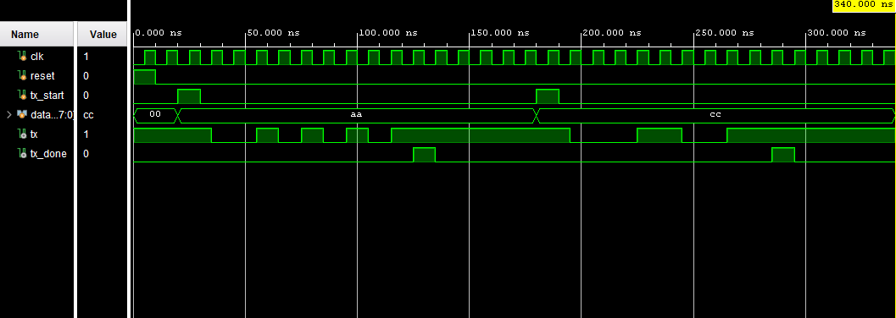

# RTL Design and Simulation of a UART Transmitter Using Verilog HDL

This project implements a **UART (Universal Asynchronous Receiver Transmitter) Transmitter** using Verilog HDL. The transmitter converts 8-bit parallel data into a serial data stream according to the UART communication protocol. The design generates a start bit, serially transmits the data bits, appends a stop bit, and indicates the completion of transmission through a status signal.

The design was developed and simulated using **Xilinx Vivado**.

---

## Features

* UART Serial Communication
* 8-bit Parallel Data Input
* Start Bit Generation
* Stop Bit Generation
* Serial Data Transmission
* Transmission Complete Indication (`tx_done`)
* Verilog HDL Implementation
* Behavioral Simulation Verification

---

## Tools Used

* Verilog HDL
* Xilinx Vivado
* Behavioral Simulation

---

## UART Frame Structure

A UART frame consists of:

```text
| Start Bit | Data Bits (8) | Stop Bit |
|     0     |   D0 ... D7   |     1    |
```

Data bits are transmitted **Least Significant Bit (LSB) first**.

Example:

```text
Input Data : 10101010

UART Frame :

0 0 1 0 1 0 1 0 1 1
↑                 ↑
Start           Stop
```

---

# RTL Schematic

The RTL schematic generated in Xilinx Vivado illustrates the internal architecture of the UART transmitter. The design consists of a shift register, bit counter, transmission control logic, and output generation circuitry responsible for serializing the input data.



---

## RTL Schematic Analysis

### Input Interface

The transmitter receives:

* `clk` : System clock
* `reset` : Resets the transmitter
* `tx_start` : Starts transmission
* `data_in[7:0]` : Parallel input data

### Shift Register

The shift register stores the UART frame:

```text
Start Bit + Data Bits + Stop Bit
```

and shifts the bits serially through the `tx` output.

### Bit Counter

The bit counter tracks the number of transmitted bits and determines when the frame transmission is complete.

### Control Logic

The control logic:

* Detects transmission requests
* Loads the UART frame
* Controls shifting operations
* Generates the transmission completion signal

### Output Signals

* `tx` : UART Serial Output
* `tx_done` : Transmission Complete Indicator

---

# Verilog Code

## uart_tx.v

```verilog
module uart_tx(
    input clk,
    input reset,
    input tx_start,
    input [7:0] data_in,
    output reg tx,
    output reg tx_done
);

reg [3:0] bit_count;
reg [9:0] shift_reg;
reg transmitting;

always @(posedge clk or posedge reset)
begin
    if(reset)
    begin
        tx <= 1'b1;
        tx_done <= 0;
        bit_count <= 0;
        transmitting <= 0;
        shift_reg <= 10'b1111111111;
    end
    else
    begin
        tx_done <= 0;

        if(tx_start && !transmitting)
        begin
            shift_reg <= {1'b1, data_in, 1'b0};
            transmitting <= 1;
            bit_count <= 0;
        end
        else if(transmitting)
        begin
            tx <= shift_reg[0];
            shift_reg <= shift_reg >> 1;
            bit_count <= bit_count + 1;

            if(bit_count == 9)
            begin
                transmitting <= 0;
                tx_done <= 1;
                tx <= 1'b1;
            end
        end
    end
end

endmodule
```

---

# Testbench

## uart_tx_tb.v

```verilog
`timescale 1ns / 1ps

module uart_tx_tb;

reg clk;
reg reset;
reg tx_start;
reg [7:0] data_in;

wire tx;
wire tx_done;

uart_tx uut(
    .clk(clk),
    .reset(reset),
    .tx_start(tx_start),
    .data_in(data_in),
    .tx(tx),
    .tx_done(tx_done)
);

always #5 clk = ~clk;

initial
begin
    clk = 0;
    reset = 1;
    tx_start = 0;
    data_in = 8'b0;

    #10;
    reset = 0;

    // First Transmission
    #10;
    data_in = 8'b10101010;
    tx_start = 1;

    #10;
    tx_start = 0;

    #150;

    // Second Transmission
    data_in = 8'b11001100;
    tx_start = 1;

    #10;
    tx_start = 0;

    #150;

    $finish;
end

endmodule
```

---

# Simulation Waveform

The following waveform verifies the UART transmission process for multiple input data values.



---

## Waveform Analysis

### Idle State

After reset:

```text
tx = 1
```

The UART line remains HIGH when no transmission is taking place.

---

### First Transmission

Input Data:

```text
AA (Hex)
```

Binary:

```text
10101010
```

UART Frame:

```text
Start Bit : 0

Data Bits :
0 1 0 1 0 1 0 1

Stop Bit : 1
```

Observed behavior:

* Transmission starts when `tx_start` becomes HIGH
* Start bit is generated correctly
* Data bits are transmitted serially
* Stop bit is generated correctly
* `tx_done` pulses HIGH after transmission

---

### Second Transmission

Input Data:

```text
CC (Hex)
```

Binary:

```text
11001100
```

UART Frame:

```text
Start Bit : 0

Data Bits :
0 0 1 1 0 0 1 1

Stop Bit : 1
```

Observed behavior:

* Start bit generated correctly
* Data bits transmitted serially
* Stop bit generated correctly
* Transmission completion indicated through `tx_done`

---

## Applications

UART communication is widely used in:

* FPGA Development Boards
* Microcontrollers
* Embedded Systems
* Arduino Projects
* ESP32 Communication
* Raspberry Pi Interfaces
* Industrial Automation
* Serial Debugging and Monitoring

---

## Learning Outcomes

This project demonstrates:

* UART Communication Protocol
* Serial Data Transmission
* Shift Register Operation
* Sequential Logic Design
* Verilog HDL Coding
* Behavioral Simulation
* Digital Communication Fundamentals

---

## Conclusion

This project successfully implements a UART Transmitter using Verilog HDL. The transmitter converts parallel input data into UART-compatible serial frames consisting of a start bit, data bits, and a stop bit. Simulation results verify correct operation for multiple data patterns and demonstrate reliable UART communication.

---

## Repository Structure

```text
UART-Transmitter/
│
├── uart_tx.v
├── uart_tx_tb.v
├── schematic.png
├── waveform.png
└── README.md
```

---

## Author

**N S Farhana**
Electronics and Communication Engineering Student
Verilog HDL | FPGA Design | Digital Electronics | VLSI Enthusiast
